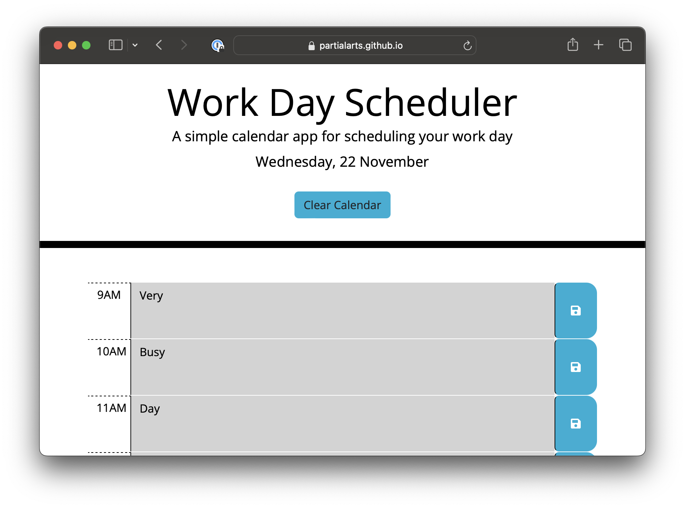

# Front End Bootcamp - Week 7 Challenge - Work Day Scheduler

## Description

The purpose of this project was to build a calendar application with JavaScript and 3rd party API's, using starter code (HTML and CSS) and featuring dynamically generated HTML and CSS powered by jQuery. The application stores events in local storage so that it can be closed and reloaded without losing data.

This was an opportunity to use Day.js to generate and format the date and time and practice the concepts learned on the course.

My approach was to generate the HTML and CSS I'd need with with jQuery. A `function` was expressed to hold the code and this was wrapped in a `for` loop for efficiency, as the elements for the calendar repeat themselves. An `if` statement was used to conditionally apply CSS classes based on the hour of the day.

A click event was used to listen for a click on all save buttons and `JSON.stringify` was used to store the values of the adjacent text fields in `localStorage` as a key/value pair. 

The jQuery `.each()` method was used to iterate over all of the hour block and then `JSON.parse` was used to return the key/value pairs as an object and append the values to the adjacent text field.

Finally a clear button was created and appended to the header. Its click event calls the `clear()` method to clear the local storage and the `reload()` method to immediately display the results on the page.

I spent some time organising the code once finished to ensure its readability, trying to group related objects together with clear comments.

## Deployed Application

* [Work Day Scheduler on GitHub Pages](https://partialarts.github.io/work-day-scheduler/)

## Usage

To use this web page, open index.html inside a browser.

Input text into the hour rows and click the save button to store. The text will be stored for when you next open the page. To clear the planner, press "Clear Calendar"

## Screenshot

### External Tutorials and Resources

* [Bootstrap CSS](https://getbootstrap.com/)
* [Day.js](https://day.js.org/)
* [localStorage in JavaScript: A complete guide](https://blog.logrocket.com/localstorage-javascript-complete-guide/)

## License

MIT - [See LICENSE file in repo](https://github.com/partialarts/work-day-scheduler/blob/main/LICENSE)